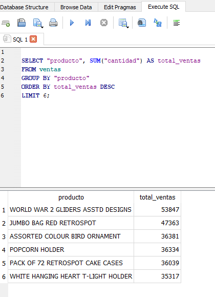

# README 

This project is a proof of concept on how to text to SQL with OpenAI. The intention is to be able to ask a question in natural language that can be translated to the right SQL statement and then query a DB.

This project works to practice and show case a skill building in langchain_community framework which is useful to work with different LLMs.


### Project Setup

Instructions to make it work in your developer sandbox

1. Clone/fork the repository 
2. Make sure to have the following prerequisites in your system
   - Python 3+
   - venv
   - updated version of PIP
   - Visual Studio Code
3. **Optional**: create a python virtual environment and activate it
4. After cloning/forking the repo using PIP install the dependencies in requirements.txt with the command

```bash
pip install -r requirements.txt
```

4. Dependencies will be installed, it will take some time
5. Then create the following file in the same folder where all the repo files are `a_env_vars.py`
6. inside that file create the following variable:

```bash
OPENAI_API_KEY = 'sk-None-xxxxx'
```

7. This will be used to store your API Key to interact with OpenAI APIs, replace the string with your API Key


### Running the Project

To execute the project in your local developer sandbox and visualize it in your browser do the following:

1. Open a terminal in Visual Studio Code (VSC has to be on the project root folder)
2. From the project terminal execute the command `streamlit run c_front_end.py`
3. A new tab will be opened in your browser with the project in StreamLit
4. You can start using the project and ask question to the existing DB


### Reference Images of the Running Project

Running interface:


Question Asked:


Answer Responded:


Same Query Executed in DBMS:



